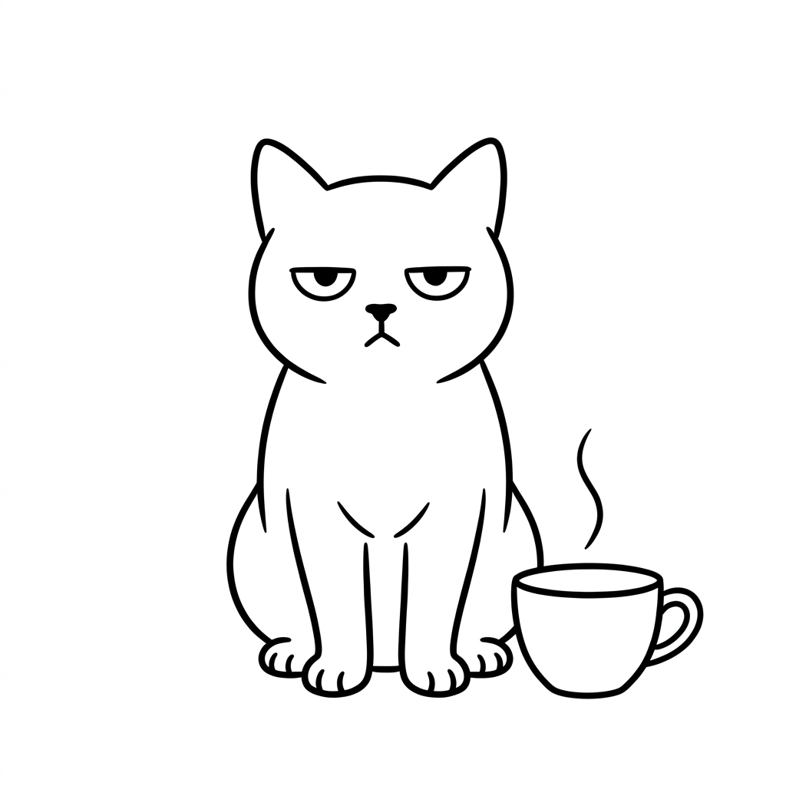

<p align="center">
  
</p>

<h1 align="center">CatCup</h1>
<p align="center">A native desktop video editor built with C++20, Qt Quick, and FFmpeg.</p>

CatCup is a Windows-first editing application with a multitrack timeline, media preview, non-destructive editing commands, project persistence, and MP4 export. It is an independent project inspired by familiar desktop editing workflows, not affiliated with or endorsed by CapCut or ByteDance.

> **Development status:** experimental. Use copies of important projects and media. The current source has not been build-verified on the current checkout machine: MSVC and Qt are missing. Historical passing tests are not validation of this revision. Preview/export parity and crash-recovery fault coverage remain release blockers.

## Implemented areas

- **Editing:** video, audio, and title tracks; split, trim, move, snapping, ripple editing, and undo/redo.
- **Media:** FFmpeg probing and decoding, audio-clocked playback, sampled thumbnails, waveform peaks, and missing-media relinking.
- **Creative tools:** transitions, clip speed, color adjustments, chroma key, and CPU pixel effects.
- **Projects:** versioned JSON, Save As, unsaved-change guards, generation-based recovery snapshots, and experimental CapCut draft interchange.
- **Export:** worker-thread H.264/AAC MP4 export, resolution options, progress, and cancellation.
- **Smart-tool foundations:** caption parsing/export, audio analysis, scene detection, and job/provenance models. These are not a complete cloud AI or transcription service.

Feature presence does not imply production readiness or parity with another editor.

## Build on Windows

### Prerequisites

- Visual Studio Build Tools with the **Desktop development with C++** workload, x64 MSVC, and Windows SDK.
- **CMake 3.28+** and **Ninja**, available on PATH.
- **Qt 6.8.3**, `msvc2022_64`, with Qt Multimedia, Qt Image Formats, and Qt Shader Tools. Full-editor presets expect `C:/Qt/6.8.3/msvc2022_64`; override `CMAKE_PREFIX_PATH` if installed elsewhere.
- The pinned **FFmpeg n8.1 gpl-shared** SDK. Follow [the dependency pin and checksum instructions](third_party/ffmpeg/PINNED.md). Dependency binaries are not committed.

Run from the repository root in PowerShell 5.1 or later. Check that each command succeeds before continuing:

```powershell
.\scripts\dev-shell.ps1
cmake --preset windows-s1-debug
cmake --build --preset s1
ctest --preset s1 --output-on-failure
cmake --build --preset s1 --target editor-ui_qmllint
```

For domain/command/persistence development without Qt or FFmpeg:

```powershell
.\scripts\dev-shell.ps1
cmake --preset windows-ninja-debug
cmake --build --preset debug
ctest --preset debug --output-on-failure
```

CMake caches are machine- and path-specific. Do not reuse a copied `build/` directory. To preserve it while configuring a clean tree:

```powershell
cmake --preset windows-s1-debug -B build/local-debug
cmake --build build/local-debug
ctest --test-dir build/local-debug --output-on-failure
cmake --build build/local-debug --target editor-ui_qmllint
```

### Run

After building with the standard presets:

```powershell
.\run.bat
```

The launcher prefers the staged Release application over Debug. Rebuild and restage Release, or launch the intended build explicitly, when verifying source changes; an existing packaged executable may be stale.

### Release packaging

```powershell
cmake --preset windows-s1-release
cmake --build --preset s1release
.\packaging\deploy-editor-ui.ps1
```

This stages a local runnable folder under `build/s1-release/dist/editor-ui/`; it does not publish a release. See [packaging requirements](packaging/README.md), including the MSVC redistributable and dependency license obligations.

## Architecture

| Module | Responsibility |
| --- | --- |
| `src/core` | Project model, IDs, rational time, and change notifications |
| `src/commands` | Undoable editing operations |
| `src/persist` | JSON serialization, migrations, and experimental draft interchange |
| `src/media` | Backend-independent media contracts and FFmpeg decoding |
| `src/render` | Pure timeline evaluator and frame plans |
| `src/effects` | Effect schemas and CPU pixel processing |
| `src/export` | Export jobs and FFmpeg MP4 encoding |
| `src/ai` | Smart-tool utilities, jobs, and provenance |
| `src/app` | Headless editor CLI |
| `src/shell` | Qt/QML application, playback, timeline, and controllers |

Qt dependencies are confined to the shell. FFmpeg headers are confined to the media/export backends. Preview and export share timeline evaluation and effect primitives, but still use distinct compositors.

## Validation and known limitations

The source registers 18 tests in the full configuration and 12 in the dependency-light configuration. Coverage includes domain operations, persistence, effects, media decoding, real MP4 exports, a 30-second editing acceptance workflow, shell regressions, draft interchange, and QML smoke loading. C++ compilation checks types; the Qt-generated `editor-ui_qmllint` target checks QML. No separate TypeScript-style typecheck is required.

Before treating a revision as releasable:

- Run a fresh full build, CTest, and QML lint; then exercise import → edit → save → reopen → export interactively.
- Compare decoded preview/export pixels for rotation, blend modes, and resolution overrides. Rotated bounds, blend modes, and sequence-coordinate title/offset scaling still need alignment.
- Exercise recovery and export failures at write/commit boundaries. Added regression tests do not establish power-loss durability, multi-instance safety, or exhaustive disk-full coverage.
- Treat CapCut draft interchange as experimental and potentially lossy; retain originals.

Build products, local exports, waveform caches, and review screenshots stay out of version control. CapCut-branded logos, bundled fonts, and unverified placeholder artwork are not included in the application resources; CatCup uses its own logo and system typography.

## Project notes

- [Architecture notes](docs/ARCHITECTURE.md)
- [Feature research](research/FEATURE-MAP.md)
- [Build plan](research/BUILD-PLAN.md)
- [Research evidence and verification gaps](research/EVIDENCE.md)
- [Historical independent review](GEMINI-REVIEW.md)
- [Review acceptance checklist](GEMINI-REVIEW-HANDOFF.md)

Research and historical handoff documents describe earlier revisions; they are not current test reports.

## Licensing and distribution

A project-wide source license has not yet been selected in this repository. Do not infer an open-source license from public availability. The pinned FFmpeg build includes GPL components, including libx264; public binary distribution requires a compliance review or a suitable dependency change and export retesting. Qt and all other dependencies retain their own license obligations. See [the FFmpeg pin](third_party/ffmpeg/PINNED.md) and [packaging notes](packaging/README.md).
