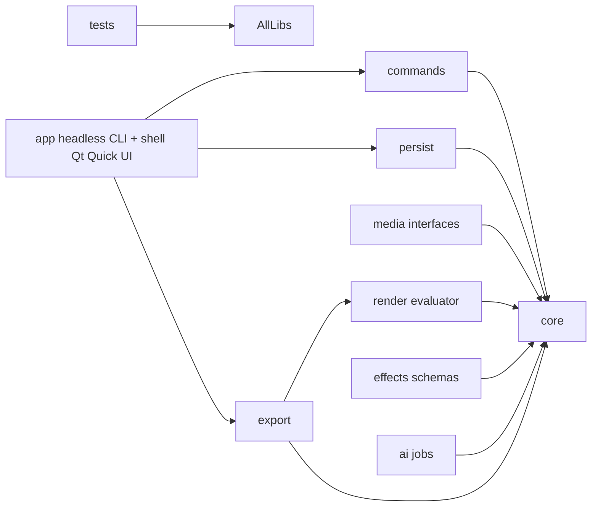

# Architecture — module boundaries (Stage 0 foundation)

Goal: never become a monolith. Every module below is a separate CMake static
library with an explicit dependency direction. Cycles are forbidden.

## Dependency graph (allowed direction only, left depends on right — never reverse)

Rules enforced by `target_link_libraries` (PRIVATE where possible):

1. `core` depends on **nothing** — pure C++20, no Qt, no FFmpeg, no JSON lib.
   Rational time, IDs, project model, result type, change bus live here.
2. `persist` depends only on `core`. Owns the minimal JSON value/parser/writer,
   schema migrations, and atomic file writes. No other module touches the disk
   format directly.
3. `commands` depends only on `core` (+ optional change-bus pointer). **All**
   persistent edits go through `ICommand` so undo/redo, autosave, and the
   future assistant use identical semantics.
4. `media` depends only on `core` and exposes **interfaces**
   (`IMediaProber`, `IThumbnailProvider`). FFmpeg includes are forbidden
   outside `src/media/ffmpeg/` (gated by `ENABLE_FFMPEG`). Stage 0 ships a
   deterministic stub for tests.
5. `render` depends only on `core`. The timeline `Evaluator` is a pure
   function `Sequence + Assets + time -> FramePlan`. Preview and export must
   both consume `FramePlan` — never duplicate timing logic.
6. `export` depends on `core` + `render`. Owns the cancellable `ExportJob`
   state machine and `IFrameSink`. The real encoder is a future sink.
7. `effects` depends only on `core`. Parameter schemas + registry; CPU
   reference implementations arrive in Stage 3 behind the same interface.
8. `ai` depends only on `core`. Job specs, cancellable queue, derived-asset
   provenance (`sourceHash + algorithmVersion + params -> output`).
9. `app` is the only module allowed to know about Qt (Stage 1+, behind
   `ENABLE_QT_UI`). Stage 0 ships a small CLI that exercises the full
   import → edit → save → reopen → export loop headlessly.

## Canonical rules (from research/BUILD-PLAN.md)

- **Integer/rational time.** `core::Rational` is canonical. Floating seconds
  and pixels are display-only conversions, never stored.
- **Stable IDs.** Clips/tracks/assets keep `Id` strings across save/load and
  undo/redo. Never use vector indices or QML object identity as identity.
- **Versioned documents.** `Project::kCurrentSchemaVersion` + `Migrations`.
  Unknown future majors are rejected with a clear error, never silently loaded.
- **Atomic persistence.** `persist::atomicWrite` (temp + flush + rename) plus
  a `.journal` backup of the previous good file.
- **Off-UI-thread media.** Decode/thumbnail/waveform/AI/export never run on
  the UI thread (enforced in Stage 1 when Qt lands; job APIs are already
  cancellable and progress-reporting so the UI can stay responsive).
- **Preview == export.** Both evaluate through `render::Evaluator`.
  Any effect that cannot run in both must be marked unavailable, never
  silently degraded (per BUILD-PLAN UI spec).

## Stage map

- Stage 0 (this scaffold): toolchain + schema + shell-less domain + tests.
- Stage 1: Qt shell + FFmpeg prober/decoder + real preview clock + MP4 export.
- Stages 2–6: per research/BUILD-PLAN.md backlog; each lands as a new module
  or a new implementation behind an existing interface — never as edits
  scattered across modules.
