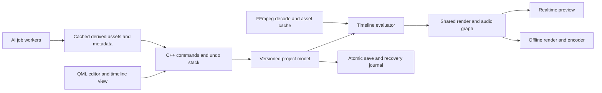

# Build plan — an approachable native video editor

## Product decision

Build a Windows-first desktop editor with the familiar workflow observed in CapCut: asset browser on the left, preview in the center, selection properties on the right, and tracks below. Preserve the ease of discovery, immediate previews, numeric controls, and direct manipulation. Use our own product identity, icons, templates, effects, and implementation.

The long-term scope includes equivalents of the observed premium feature families. They require media algorithms, trained models, content catalogs, and sometimes hosted services. A UI recreation alone does not deliver them.

## Language and framework decision

| Layer | Proposed choice | Why and evidence confidence |
|---|---|---|
| Application/domain core | C++20 | Native media integration and explicit resource/thread ownership. CapCut's Qt and C++ runtime libraries support this direction, but do not reveal every source language. C++20 is our choice, not an observed CapCut standard. |
| Desktop interface | Qt 6 Quick, QML, limited JavaScript | Both inspected installs contain Qt6Qml/Qt6Quick/QuickControls2. This is the closest evidence-backed framework match. |
| Decode, encode, demux, audio conversion | Independently obtained FFmpeg libraries | Both installs contain avcodec/avformat/avfilter/swscale/swresample. Our application should use its own pinned dependency build. |
| Timeline renderer | Custom QQuickItem backed by C++ models | Virtualize visible tracks/clips and thumbnails. Avoid creating an item for every frame or waveform sample. |
| Video compositor | Shared native render graph, integrated with Qt's graphics interfaces | Preview and export must evaluate the same effect order and timing. Start with CPU reference paths and add measured GPU acceleration. |
| Project format | Versioned JSON document plus relative asset references; disposable cache/index | Human-inspectable early format; atomic writes, migrations, relink support. This is our design, not CapCut format compatibility. |
| Build | CMake, MSVC, Ninja, pinned dependency manifests | Reproducible Windows builds; confirm installed toolchain before implementation. |
| AI runtime | Pluggable C++ inference workers; evaluate ONNX Runtime/Windows ML and CPU fallback | Select per model and benchmark. Do not assume one provider supports all models. |
| Hosted AI | Provider adapters and asynchronous job API where needed | Generation, avatars, translation/dubbing, and assistant features can have separate availability and cost. |

Do not reproduce the installed Qt 6.2.2.617 runtime version simply because it is present. Select a supported Qt release that passes our compatibility and packaging checks. Installation contents establish components, not the full proprietary architecture.

Qt Quick provides a GPU-oriented scene graph and C++ extension points; FFmpeg documents its media libraries and filter infrastructure. These support the proposed architecture rather than proving CapCut uses our proposed design. Sources: [Qt scene graph](https://doc.qt.io/qt-6/qtquick-visualcanvas-scenegraph.html), [FFmpeg documentation](https://ffmpeg.org/documentation.html).

The current ONNX Runtime documentation says DirectML remains supported but new Windows deployment work is moving toward Windows ML. Evaluate current Windows ML integration before choosing DirectML as the default. [ONNX Runtime guidance](https://onnxruntime.ai/docs/execution-providers/DirectML-ExecutionProvider.html)

## Core architecture



### Data contracts to establish first

- `Project`: schema version, canvas, rational frame rate, color space, assets, sequences, and references.
- `Sequence`: track order, work range, duration, markers, and audio routing.
- `Track`: type, lock, visibility/mute, and ordered clip references.
- `Clip`: stable ID, source reference, source in/out, sequence start, time mapping, transform, effect stack, and automation curves.
- `Effect`: versioned type, parameters, enabled state, processing order, and keyframes.
- `TextClip` / `CaptionCue`: content, style, timing, layout, and optional word timings.
- `DerivedAsset`: source hash, algorithm/model version, parameters, output location, and validity metadata.
- `Job`: immutable inputs, progress, cancellation, failure reason, retry policy, and output provenance.

Use integer/rational time. Do not use pixels or floating-point seconds as the canonical timeline storage. Keep project state independent of QML object lifetimes. All persistent edits go through commands so undo, redo, assistant actions, and autosave use the same semantics.

### Media and performance rules

Decoding, thumbnail generation, waveform analysis, AI inference, and exports run off the UI thread. Bound queues and caches. Cancel obsolete seek requests. Treat audio as the playback clock and evaluate video against it. Use reduced preview resolution or proxies when necessary without silently lowering export quality.

Start with Rec.709 SDR, ordinary MP4 sources, one video stream, and predictable frame rates. Add variable-frame-rate handling, HDR, additional codecs, and high-resolution pipelines after timestamp and color correctness are covered.

The fixture is eight seconds of MPEG-4 video with AAC audio at 1280×720/30 fps. It helps with basic timing and import checks; it is insufficient for testing speech, portraits, scene understanding, or restoration quality.

## Staged delivery and acceptance gates

Milestones are an implementation sequence, not a delivery-time promise. Full parity is a sustained product effort. Estimates should follow a measured playback/export prototype and a feature-quality benchmark.

| Stage | Scope | Acceptance gate |
|---|---|---|
| 0 — Foundation | Toolchain; dependency versions; project schema; C++/QML application shell; logging | Clean configure/build/package on Windows; empty project opens and saves |
| 1 — Usable editing loop | Import; thumbnails; one video and one audio track; play/seek; split/trim/move; title; undo/redo; save/reopen; MP4 export | A user can make a 30-second edit, reopen it, and export the same frames, timing, title, and sound |
| 2 — Everyday editor | Multitrack; snapping/ripple; overlays; transforms/keyframes; transitions; audio fades; waveform; proxies; relinking | Overlapping clips and transitions survive edits, undo, save/reopen, and export consistently |
| 3 — Creative tools | Mask/chroma key; color/HSL/curves/LUT; text styles; animation curves; speed ramps; reusable presets | Preview/export agreement for supported effects; useful preset library built with our assets |
| 4 — Practical advanced tools | Caption transcription; editable word timing; voice cleanup; background segmentation; stabilization; tracking/reframe | Quality tests on representative speech, portraits, camera motion, and occlusion; cancellation and fallback work |
| 5 — Restoration and specialist AI | Upscaling; denoise; interpolation; relight; retouch; removal/inpainting; lip sync; translation/dubbing | Per-feature quality and performance targets pass; model licenses and resource costs documented |
| 6 — Connected product | Template service; optional project sync; review/share; generated assets; avatars; assistant editing | Account, job, conflict, upload, cost, and failure behavior tested end to end |

### First implementation batch

1. Inspect available MSVC/Windows SDK/Qt/CMake tooling; install or configure the missing development dependencies through ordinary development tooling. Only Git was found on PATH in the initial lightweight check; that was not a complete machine audit.
2. Create the desktop repository and CMake presets. Use C++20 and a supported Qt 6 release.
3. Implement `Project`, `Asset`, `Track`, `Clip`, and rational time types; add atomic JSON save/load and schema versioning.
4. Build the four-region QML editor shell with resizable splitters, selected-item styling, and keyboard focus indicators.
5. Add FFmpeg asset probing and an asynchronous thumbnail provider.
6. Implement clip placement, selection, playhead movement, zoom, split, trim, and undo/redo in the C++ domain layer.
7. Implement decoded preview and audio clock synchronization with bounded seek/decode queues.
8. Add a text overlay and a shared render description used by preview and export.
9. Implement cancellable MP4 export with progress and explicit failure messages.
10. Package a runnable build and perform the Stage 1 acceptance edit.

**First demonstrable result:** import a clip, make two cuts, add a title, preview it, save/reopen, and export a playable file. This should precede the large AI catalog.

Suggested source organization:

```text
app/                  application entry, QML registration
ui/                   layout, browser, inspector, transport, timeline view
core/project/         model, serialization, schema migrations
core/commands/        edits, undo/redo, change notifications
media/                probing, decode, thumbnails, waveforms, proxies
render/               timeline evaluation, compositor, audio mixer
export/               offline render, encoding, jobs
effects/              parameter schemas, CPU reference and GPU implementations
ai/                   inference/provider adapters, models, derived assets
assets/               original icons, styles, sample presets
tests/                domain, integration, render fixtures
packaging/            Windows deployment and dependency manifest
research/             discovery evidence and parity backlog
```

## Advanced feature implementation backlog

These are proposed implementation approaches, not claims about CapCut internals. Every family stays in scope, but implementations can ship in stages.

| Feature family | Proposed implementation | Main dependency or hard part | Stage |
|---|---|---|---|
| Effects, filters, transitions | Parameterized shaders and CPU references; preset metadata | Consistent effect order, alpha, color, and export | 2–3 |
| Titles and text templates | Native text layout; keyframed properties; original template definitions | Font packaging, shaping, wrapping, preview/export agreement | 1–3 |
| Stickers, shapes, animated assets | Vector/raster layers plus supported animation imports | Asset licenses, caches, timing, blend behavior | 3 |
| HSL, curves, color wheels, LUT | Color pipeline with configurable transforms | Working space, range, HDR extension | 3 |
| Auto color and match | Analysis plus parameter suggestions | Stable shots, reference matching, reversible adjustment | 4–5 |
| Mask and chroma key | Geometric masks, feathering, spill suppression | Edge quality, premultiplied alpha, keyframes | 3 |
| Auto/custom background removal | Segmentation/matting model and correction strokes | Temporal consistency, hair, occlusion, GPU memory | 4 |
| Captions and transcript | Speech recognition, word timings, editable cues | Language accuracy, timing, punctuation, speaker changes | 4 |
| Bilingual captions and fillers | Translation and transcript analysis over editable cues | Preserve timing and user corrections | 4–5 |
| Lyrics | Lyric/voice alignment with user correction | Music and singing differ from ordinary speech | 5 |
| Loudness and cleanup | Loudness analysis, gain, filters, denoising models | Clipping prevention, artifacts, repeatable measurements | 3–4 |
| Voice isolation/changer | Separation model plus pitch/formant or voice processing | Quality, speech/music cases, latency | 4–5 |
| Text to speech | Licensed local model or provider adapter | Voice catalog, pronunciation, language and usage costs | 4–6 |
| Translation and dubbing | ASR → translation → speech synthesis → alignment | Timing, speaker continuity, review workflow | 5 |
| Stabilization and tracking | Feature/flow tracking, motion estimation, crop smoothing | Rolling shutter, drift, occlusion, cuts | 4 |
| Auto reframe / shorts | Subject detection/tracking plus crop or segment proposals | Semantic quality and avoiding unwanted cuts | 4–5 |
| Speed curves | Time-remapping curve, resampling and audio stretching | Correct source-time integration and joins | 3 |
| Optical flow / slow motion | Interpolation model or flow-based algorithm | Occlusion, scene cuts, temporal artifacts, compute | 5 |
| Upscale / denoise / flicker | Restoration models and temporal filters | Detail hallucination, consistency, throughput | 5 |
| Motion blur | Temporal accumulation or motion-aware approximation | Alpha/occlusion and real-time cost | 3–5 |
| Retouch / eye contact / relight | Landmark, segmentation, and specialized models | Identity preservation and stable output across frames | 5 |
| AI remove / expand / remix / stylize | Video/image generation or inpainting jobs | Model availability, compute cost, reproducibility | 5–6 |
| Lip sync and avatars | Licensed specialized model/provider, timed audio | Temporal quality, inputs, model rights | 5–6 |
| Camera tracking / AI movement | Camera/motion estimation or generated transformations | Scope of true 3D versus 2D motion must be defined | 5 |
| Compound clips / multicamera | Nested sequences, synchronized sources, camera-angle edits | Cycles, source sync, nested time maps | 3–4 |
| Screen and voice recording | OS capture/audio APIs, device selection, recording jobs | A/V sync, permissions, interruptions | 3–4 |
| Templates | Original project/preset schemas with replaceable media slots | Asset catalog and format evolution | 3–6 |
| Spaces and sharing | Optional object storage, project versions, review model | Conflicts, offline state, bandwidth, ongoing costs | 6 |
| Edit assistant | Natural-language proposals translated into validated commands | Reviewability, undo, bounded actions, project context | 6 |

## UI specification for the first build

- Dark neutral panels, legible white/gray text, one teal accent for selection and primary actions.
- Persistent asset tabs and searchable cards; advanced tools remain in contextual panels.
- Adjustable browser/preview/inspector widths and timeline height, with sensible minimum sizes.
- Slider and numeric input for precision; explicit units; reset control; keyframe control when supported.
- Selection in timeline and preview stays synchronized. Multi-selection shows shared editable properties.
- Drag/drop, mouse, and keyboard paths should reach the same commands.
- Export stays available in the top-right with a clear output summary and progress/cancel state.
- Long operations expose progress, cancellation, and useful failures without freezing the editor.
- Ship accessible names and keyboard navigation from the beginning; CapCut's custom UI exposed little accessibility information during this survey.
- No decorative control should appear functional when its processing engine is not implemented. Show unavailable capabilities explicitly in development builds.

## Meaningful verification

Test timeline invariants, rational time conversion, trim boundaries, compound time maps, undo/redo, and project migrations. Integration tests should import media, create an edit, reopen it, and compare decoded export frames/audio against expected timing. Include files with different frame rates, missing sources, corrupt input, Unicode paths, portrait orientation, and cancellation.

For advanced AI, keep a representative evaluation set and measure both perceptual quality and runtime. A colored test pattern cannot validate background removal, captions, retouching, or voice cleanup.

Set playback performance targets on a named reference PC after the prototype. Measure dropped frames, seek latency, audio drift, memory, and export throughput. Avoid promising 4K/8K real-time processing before hardware and algorithms are benchmarked.

## Decisions still needed before the relevant stages

### Additions from the signed-in 9.4 survey

The EditPilot prompt form and Spaces media browser became accessible after the user signed in. More detailed AI and voice panels were also inspected. Incorporate these requirements into Stages 5–6:

1. **Model capabilities:** each generation provider declares supported reference types, output count, duration, resolution, aspect ratio, fit mode, audio support, and access requirements. Build forms from this metadata rather than hard-coding one model's options.
2. **Job estimates:** show availability and estimated usage/cost before submission. Keep free allowance, subscription access, and credits distinct. The inspected AI image form showed Free while the selected video model still required Pro.
3. **Assistant proposals:** support suggested common edits and free-text input, translated into the existing validated command/undo system. Execution was not tested in CapCut; our proposal/review behavior remains a design decision.
4. **Cloud media browser:** include account-space selection, media cards, search/sort/filter, upload progress, capacity meter, and relink/cache handling. Cloud storage is separate from local project persistence.
5. **External asset sources:** define an adapter for same-account generated-asset import/sync, motivated by the Dreamina entry. Do not assume access to Dreamina's private APIs.
6. **Voice catalog:** support language/style metadata, search, favorites, provider access markers, and a separately scoped custom-voice workflow. CapCut's entry advertised a ten-second sample, which does not establish our own model's required sample length or quality.

These findings expand the connected-feature backlog. They do not change the C++/QML/FFmpeg foundation or the decision to build reliable local editing first.

The initial assumption is Windows-first and local editing by default. Choose supported minimum hardware after the decode prototype. Decide distribution and dependency licensing before packaging a public build. Choose whether expensive AI features run locally, through user-provided services, or through a funded backend before Stage 5/6. Cloud compute and content catalogs have continuing costs even when the interface exposes features without a subscription tier.

Build functional equivalents using independent code and licensed dependencies/models/assets. The installed CapCut binaries were inspected as evidence; they are not application dependencies to redistribute. No CapCut project-format compatibility or access to proprietary cloud models is assumed.
