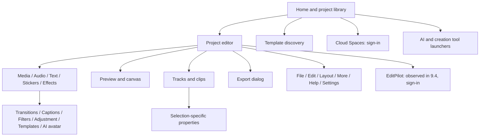

# CapCut desktop feature map

## Scope and evidence labels

Surveyed through the Windows Computer Use skill on September 7–8, 2026. Version A is 8.8.0.3774; version B is 9.4.0.4015. Entries below are version A unless specifically marked B.

- **Exercised:** performed in the isolated inspection project and observed the result.
- **Inspected:** opened the panel and read its controls; did not validate the algorithm or export result.
- **Entry only:** navigation label or disabled control was visible; deeper behavior remains unverified.
- **Gated:** sign-in or another access dependency was observed.
- **Pro badge:** a diamond or Pro marker was visible in this installation. This does not establish a universal subscription rule across regions, versions, or accounts.

## Signed-in follow-up — version B, September 8

The user signed in manually using an account they described as non-premium. This follow-up supersedes the earlier sign-in-blocked observations for the EditPilot form and the editor's Spaces browser. It does not revalidate every version A inspector or establish that all newly inspected panels require login.

| Area | Newly observed detail | Access and verification |
|---|---|---|
| EditPilot Beta | Prompt field and send button; suggested actions to set square canvas, improve clip quality, or format for vertical Shorts | Sign-in gate replaced by usable-looking form. No prompt submitted; assistant execution/credits unverified |
| Spaces in Media | Personal-space navigation; populated cloud media cards; Upload; search/sort/filter controls; usage meter; Upgrade | Browser loaded. Account showed about 946.5 MB used of 1024 MB. This is account-specific, not a universal free-plan quota. No cloud assets changed or uploaded |
| Dreamina | Sync from Dreamina action, described as retrieving assets from the same account | Entry inspected; sync not started |
| Generate / AI image | Reference attachment slot; prompt requesting image description and count from 1–10; Showcase; model selector | Form inspected; no reference attached or prompt submitted |
| AI image settings | Seedream 4.3 selected; 2K and 16:9 shown; Generate marked Free | Displayed configuration only; actual free allowance and successful generation unverified |
| Generate / AI video | Image to video and Omni reference modes; references can include images, video, or audio with prompt mentions | Form and tutorial inspected; remaining overflow modes not enumerated |
| AI video model | Dreamina Seedance 2.5 selected, with Pro marker | Explicit Join Pro message remained visible after login |
| AI video settings | 10 seconds, 720p, Fit, one output, and Audio toggle shown; Generate displayed a credit-like icon with 2100 | Exact units/charging behavior not verified; no generation started |
| AI dialogue scene | Talk or sing and React modes; Upload character photo; input area and Generate | Tutorial describes selecting who speaks in a multi-character image; no upload or generation |
| Text inspector | Basic, Bubble, Effects subtabs visible in 9.4 | Additional text-style navigation recorded |
| Text to speech | Search; favorites; Custom voices; Trending; NEW; filters; multilingual voice cards; Generate speech | Catalog loaded, including mixed Pro-marked and unmarked cards; no speech generated |
| Custom voices | Create entry advertising creation from ten seconds of audio | Entry only; no voice uploaded, recorded, or created |

**What login established:** the EditPilot sign-in screen and empty Spaces sign-in screen were replaced by richer interfaces. The generation and voice panels provide additional design evidence, but this survey cannot attribute every difference to login rather than version, loading, or simply opening a previously uninspected panel.

**Build-plan additions:** use capability-aware model forms, explicit estimated usage/cost, reference-input types, selectable output settings, voice catalog metadata, and independent cloud-media synchronization. Premium algorithm quality and assistant execution remain untested.

## Screen and navigation structure

## Home and project management

| Area | Observed controls or behavior | Coverage |
|---|---|---|
| Account | Sign in; Join Pro | Entry only; account was signed out |
| Home | Large Create project action; project thumbnails | Exercised project creation |
| Project management | Search; view selector; Trash; Project sync | Inspected labels; did not alter existing projects |
| Templates | Search; orientation, clip-count and duration filters; category chips; preview cards; featured labels; usage/clip counts | Inspected populated browser |
| Template categories | For you and several localized categories; Pro chip | Inspected; categories are dynamic and localized |
| Spaces | Expandable navigation; My Space; cloud storage/sharing/editing description | Gated by Sign in now |
| Main launchers | Video Studio; Record screen | Entry only |
| Expanded tools | Long video to shorts; AI video; AI image; Video translator; AI dialogue scene | Entry only |
| Expanded tools, second row | AI fashion model; Text to speech; Enhance quality; Auto cutout | Entry only |
| Other products | Design Studio; Create with AI; Marketing tools | Entry only; destinations not mapped |
| Promotions | Invite friends and promotional cards | Visible, outside initial editor build scope |

## Editor layout and interaction model

The editor has a thin application bar, a three-column upper workspace, and a full-width timeline below. The left column changes with the selected asset category. The middle column is the preview. The right column shows project details when nothing is selected and clip-specific controls when a timeline item is selected.

At the observed approximately 1280-pixel width, the left browser occupied about 400 pixels, the preview about 480 pixels, and the inspector about 370 pixels. These are approximate observations, not fixed layout specifications. The window was resizable and toolbar categories overflowed horizontally.

| Region | Observations | Build implication |
|---|---|---|
| Application bar | Menu; autosave status; project name; layout-related icons; Pro; Share; Export | Keep editing status and primary output action visible |
| Asset browser | Category toolbar; subsection navigation; searchable card grids; add buttons; downloads and Pro badges | Reusable browser shell with category-specific providers |
| Preview | Timecodes; playback button; quality indicator; ratio; fullscreen; transform handles on selection | A real media surface with editable overlays |
| Inspector | Tabs change for video and text; nested subtabs; collapsible groups; sliders plus numeric values; reset and keyframe diamonds | Declarative property metadata and selection-driven panels |
| Timeline | Ruler; playhead; thumbnails; embedded audio waveform; separate text track; clip name and duration | Real temporal data, independently represented from widget positions |
| Track headers | Lock; visibility; audio-related control; more menu | Track-level state distinct from clip-level state |
| Timeline toolbar | Undo/redo; editing icons; microphone; snapping/link-related controls; zoom | Tooltip and shortcut mapping still needs a dedicated pass |
| Empty states | Import target and drag-media-to-timeline guidance | Give one clear next action |
| Notifications | Tutorial popovers; shortcut conflict notice | Nonblocking education and discoverable errors |
| EditPilot, version B | Docked editing assistant with sign-in entry | Gated; command-based assistant can be a later module |

## Asset browsers

| Category | Observed functions | Coverage and qualifications |
|---|---|---|
| Media | Import video/photo/audio; native file picker; card preview; card add button | Exercised with synthetic MP4 |
| Media navigation | Media; Subprojects; Yours; Generate; Spaces; Library | Inspected labels; subproject/cloud internals unverified |
| Media creation | Generate; AI avatars; Record | Entry only |
| AI clipper | Start clipping; Free/Try free labeling differed between sessions | Entry only |
| Audio | Import; Yours; Music; sound effects; Copyright; search songs/artists | Inspected shell; catalog initially loading |
| Text | Default text; Yours; Text effects; Text template; Auto captions; Local captions | Default title insertion exercised |
| Stickers | Yours; Stickers; Shapes; GIPHY | Inspected shell; catalog initially loading |
| Effects | Favorites; Video effects; Body effects; search | Inspected shell; effect catalog initially loading |
| Transitions | Favorites; Transitions; search | Inspected shell; transition catalog initially loading |
| Captions | Auto captions; Templates; Auto lyrics; Add captions | Inspected |
| Caption generation | Spoken language; bilingual output; identify filler words; replace-current-caption option; Generate | Bilingual/filler and generation Pro markers observed; generation not submitted |
| Filters | Favorites; Featured; NEW; Hits; CCD; Life; Photo Booth; Pet; searchable downloadable cards | Populated catalog inspected; several cards had Pro badges |
| Adjustment | Custom adjustment item; Yours; LUT | Inspected |
| Templates and AI avatar | Further top-level tabs after horizontal overflow | Entry only |

A browser card preview is not equivalent to adding a clip. In the exercised flow, the card's plus button inserted media or text into the timeline. A synthetic clip drag attempt did not visibly insert it, so drag-and-drop is not counted as successfully tested.

## Video inspector

| Section | Observed controls | Pro badge or other limitation |
|---|---|---|
| Basic / Transform | Scale; uniform scale; X/Y position; rotation; alignment; reset and keyframe controls | Inspected, defaults left unchanged |
| Basic / Stabilize | Enable and expandable settings | Pro badge |
| Basic / Enhance quality | Enable and expandable settings | Pro badge; displayed three uses left that day |
| Basic / Reduce image noise | Enable and expandable settings | Pro badge |
| Basic / Optical flow | Enable and expandable settings | Pro badge |
| Basic / AI remove | Enable and expandable settings | Pro badge |
| Basic / AI expand | Enable and expandable settings | Free label observed; no generation exercised |
| Basic / AI remix | Enable and expandable settings | Pro badge |
| Basic / Eye contact | Enable/info entry | Entitlement not established |
| Basic / Lip sync | Enable and expandable settings | Pro badge |
| Basic / Relight | Enable/settings/keyframe controls | Pro badge |
| Basic / Auto reframe | Enable and expandable settings | Pro badge |
| Basic / Remove flickers | Enable and expandable settings | Pro badge |
| Basic / AI movement | Enable and expandable settings | Pro badge |
| Basic / Camera tracking | Enable and expandable settings | Pro badge |
| Basic / Motion blur | Enable and expandable settings | Pro badge |
| Basic / Canvas | Enable/expand; Apply to all | Inner options unverified |
| Remove BG | Auto removal; Custom removal; Chroma key | Auto removal Pro badge; algorithms not run |
| Mask | Mask group; Add mask; partially visible shape choices | Nested editor not exercised |
| Retouch | Face; Body; Hair; Face presets; Body presets; Auto styles; Retouch; Save as preset | Auto styles Pro badge; catalog loading; no person fixture tested |

The space between transform controls and the first observed enhancement section was not exhaustively enumerated. Blend/opacity controls should be checked explicitly in a follow-up rather than assumed from other editors.

## Audio, speed, animation, and color

| Inspector | Observed controls | Coverage |
|---|---|---|
| Audio / Basic | Volume in dB; fade in/out in seconds; keyframe controls | Inspected |
| Audio processing | Normalize loudness; Enhance voice; Video translator; Reduce noise | Pro badges observed |
| Audio isolation | Isolate voice; Fill channel entry | Inspected labels; channel entry disabled for fixture |
| Voice changer | Separate audio subtab | Entry only |
| Speed / Standard | Speed multiplier; source/output duration; Change audio pitch; Reset | Inspected at 1.00x |
| Smooth slow-mo | Option tied to reduced speed | Pro badge; disabled at current speed |
| Speed / Curve | None; Custom; Montage; Hero; Bullet; Jump cut; Flash in; Flash out | Preset grid inspected |
| Velocity effects | Separate speed subtab | Pro marker near this area; exact scope unverified |
| Animation | In; Out; Combo; search; category chips; preview cards | Inspected; mixed Pro/download badges |
| Adjust / Basic | Auto adjust; Color match; Color correction; LUT; Save as preset; Apply to all | First three had Pro badges after loading |
| Color tools | HSL; Curves; Color wheel; Mask | Subtabs observed; nested controls not exhaustively opened |
| AI stylize | AI effects; prompt; showcase; random; Generate; Style; category chips | Inspected form, no job submitted |

## Text and caption objects

Inserting Default text created an independent approximately three-second title clip above the eight-second video. Selecting it showed an editable preview bounding box and a different inspector.

| Text feature | Observed UI | Coverage |
|---|---|---|
| Typography | Text area; font selector; font size; bold/underline/italic; Save as preset | Inspected top of Basic panel |
| Text animation | Animation tab | Entry only |
| Motion tracking | Tracking tab; None and Motion tracking cards | Inspected; Pro badge |
| Speech generation | Text to speech tab; upgrade/credits tooltip | Entry only; no voice generation |
| AI text functionality | Additional AI-related tab partly visible at right edge | Exact label and inner controls unverified |
| Caption workflow | Automatic, lyric, bilingual, manual/local paths in asset browser | Generation and subtitle import/export not exercised |

## Timeline context menu

Observed on the synthetic video clip:

| Function | Observed shortcut or state |
|---|---|
| Copy / Cut | Ctrl+C / Ctrl+X |
| Copy attributes / Paste attributes | Ctrl+Shift+C / Ctrl+Shift+V; paste disabled in test state |
| Delete | Backspace shown; not executed |
| Edit submenu | Present; submenu not mapped |
| Split scenes | Present |
| Transcript | Pro badge |
| Isolate voice | Submenu |
| Extract audio | Ctrl+Shift+S; Pro badge |
| Sync video and audio | Disabled in single-clip state |
| Create compound clip (subproject) | Alt+G |
| Create multi-camera clip | Disabled in single-clip state |
| Save preset | Present |
| Group / Ungroup | Ctrl+G / Ctrl+Shift+G; disabled for current selection |
| Export selected clips | Present |
| Deactivate clip | V |
| Trim clip / Replace clip | Present; trim appeared disabled in captured menu |
| Link to media / Open file location | Link disabled in captured state |
| Edit effects | Disabled in captured state |

Undo/redo, cut/split, ripple semantics, multiple selection, nested timelines, multicamera switching, and keyboard transport need behavioral tests. Presence of a control is not proof of how edge cases work.

## Export

| Field | Direct observation |
|---|---|
| Project/output | Timeline identity; filename; destination folder; edit cover |
| Video | Separate enabled output section |
| Resolution dropdown | 480p; 720p; 1080p; 2K; 4K; 8K |
| Bit rate | Higher selected; complete dropdown not enumerated |
| Codec | H.264 selected; complete dropdown not enumerated |
| Container | MP4 selected; complete dropdown not enumerated |
| Frame rate | 30 fps selected; complete dropdown not enumerated |
| Color space | Rec.709 SDR shown for fixture |
| Audio-only output | Separate checkbox; MP3 shown |
| GIF | Separate checkbox; 240p shown |
| Captions | Separate section; Pro badge; SRT shown in secondary capture |
| Footer | Duration and estimated size; Export and Cancel |

The export dialog was inspected and canceled. No completed CapCut export, 8K render, codec combination, HDR output, or Pro entitlement was verified.

## Settings and remaining coverage

The application menu exposed File, Edit, Layout, More, Help, Settings, Back to home page, and Quit. The Settings action could not be reliably opened through the transient menu during this survey; preference internals remain unmapped. Repeated window capture occasionally returned stale frames or `no monitor found for window`; window selection was refreshed before continuing.

Highest-value remaining observations:

1. Revalidate the inspector matrix on 9.4 and record changed labels or entitlements.
2. Preferences: project/cache locations, proxy policy, hardware decoding/encoding, performance, editing defaults, language, and shortcuts. These are investigation targets, not confirmed controls.
3. Behavioral timeline tests: split/trim/move, snapping, ripple, linking, keyframes, multi-track overlaps, compound clips, undo and recovery.
4. Expand mask, HSL/curves, stabilization, reframe, tracking, chroma key, canvas, and audio submenus.
5. Inspect representative downloaded effects/transitions and text templates; catalog breadth is not finite or fixed.
6. Map recording and the separate Design Studio/Video Studio/marketing destinations.
7. With an appropriate signed-in session, inspect gated cloud, EditPilot, and premium outputs. Access was not available during this survey.
8. Test export results with motion, speech, portraits, variable-frame-rate footage, HDR, and long-form timelines.
